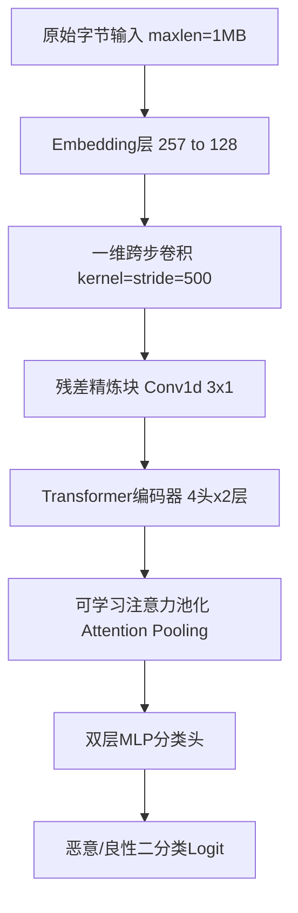

# MalConv 项目模型训练与实验性能评估报告

## 1. 评估背景与数据概览

本报告针对 `MalConv` 恶意软件静态检测项目在 GPU 环境（NVIDIA GeForce RTX 4050 Laptop GPU，6.0 GB 显存）下完成的 `MalConv1` 模型训练与评估实验进行深入剖析。实验基于 `DikeDataset` 的本地样本和标签数据，深入验证了深度学习端到端原始字节检测路线在恶意 Windows PE 文件分类上的表现。

### 1.1 数据集分布与极端不平衡问题
实验使用的数据集具有明显的类别不平衡特征：
- **良性样本**：1,082 个
- **恶意样本**：10,765 个
- **总样本数**：11,847 个
- **比例关系**：良性与恶意的比例接近 **1 : 10**，是一个典型的极度不平衡数据集。

在机器学习中，若不加处理地在不平衡数据集上进行训练，模型会倾向于把所有样本都预测为多数类（恶意），从而导致虽然“准确率”很高，但在少数类（良性）上的误报率（FP Rate）极高，完全失去实用价值。

### 1.2 应对不平衡的核心策略
项目在数据和 Loss 层面同时采用了两项精细化的平衡调优技术：
1. **加权采样器（`WeightedRandomSampler`）**：
   在训练集中，对良性样本（少数类）进行过采样。根据良性与恶意样本的倒数计算采样权重，使得在每一个 Batch 的采样中，良性与恶意样本被抽中的概率基本均等（等效于 1:1），从而在数据源头纠正了数据分布偏差。
2. **类别加权损失函数（`BCEWithLogitsLoss(pos_weight=pos_weight)`）**：
   在损失计算层面，利用公式 `pw = n_neg / n_pos`（训练集中良性数/恶意数 ≈ 0.11）作为正样本（恶意样本）的 Loss 权重。这相当于对良性样本（少数类）的分类错误给予了大约 9 倍的惩罚权重。在 Loss 层面强制模型必须高度重视良性样本的决策边界，防止模型由于惯性产生偏置。

---

## 2. 架构设计与性能评估

本项目实现的 `MalConv1` 不仅是原始 MalConv 的简单复现，而是一个结合了**一维跨步卷积**、**残差精炼**与 **Transformer 编码器**的混合深度学习网络。

### 2.1 混合架构的设计意图剖析
- **字节嵌入层（`Embedding`）**：将 0-255 的离散字节和 256（Padding）映射为 128 维（在配置中设为 64/128）的稠密连续向量。由于字节之间无大小逻辑但有空间关联性（如 PE 文件头的 `MZ` 标志），该层能够让模型在向量空间中学习字节的潜在表达。
- **跨步卷积下采样（`Conv1d`）**：1MB 的 PE 文件长度达 100 万字节。如果直接输入 Transformer，其 $O(N^2)$ 的自注意力计算量（$10^6 \times 10^6 = 10^{12}$ 次计算）将彻底撑爆任何 GPU。通过核大小和步长均为 500 的跨步卷积，将 100 万字节高效“压缩”成大约 **2097** 个块。这不仅解决了计算瓶颈，还将字节级特征提炼为宏观的结构信息块。
- **残差精炼块（`Residual Refinement`）**：不重叠的跨步卷积存在明显的“边界效应”（即关键指令或地址可能正好被切断在 500 字节的边界处）。设计两个带残差连接的 3x1 卷积，能够使相邻的数据块互相融合边界信息，修复潜在的上下文断层。
- **Transformer 编码器**：在压缩到 2,097 长度的全局特征上运行自注意力。PE 文件的头部结构（如 Data Directories）与后续的节区（如导入表 Section）存在天然的逻辑跨度。传统的 CNN 受限于局部感受野无法建立这种超长距离的关联，而 Transformer 的多头自注意力机制（Self-Attention）让文件头部与尾部直接进行“对话”，捕捉到了 PE 文件全局的语义关联。
- **可学习注意力池化（`Attention Pooling`）**：不同于简单粗暴的 Global MaxPooling（可能丢失大量局部信息）或 Mean Pooling（可能稀释关键特征），通过训练一个查询层自动计算每个结构块的贡献权重，使得决策更关注入口点（Entry Point）或高敏代码段等高价值区域。

### 2.2 模型规模与计算效率
- **参数量**：4,612,514 (约 4.61 M)。
- **分析**：虽然这比起参数量动辄上千万的重型图像或文本模型算轻量，但相对于传统的 LightGBM/XGBoost 等浅层机器学习模型而言，其表达能力呈指数级提升。
- **显存与训练优化**：在 6.0 GB 显存的 RTX 4050 上，通过混合精度训练（`GradScaler` 自动混合 fp16 和 fp32）与梯度累积（`batch_size=4, grad_accum_steps=8`，等效 Batch Size = 32），成功在受限显存内实现了大模型的高效训练，每秒处理多个 1MB 的大样本，显存开销控制在 1GB 左右。

---

## 3. 训练过程与收敛性分析

根据训练历史数据（`training_history.csv`）和训练曲线（`training_curve.png`），我们可以得出以下核心结论：

### 3.1 极速拟合与收敛特征
- **训练表现**：模型在 **Epoch 1** 就表现出了惊人的学习速度，训练 Loss 直接下探到 **0.0463**，Train Acc 达 **88.66%**。到 **Epoch 5** 时，训练 Loss 已经降至 **0.0046**，Train Acc 达 **99.22%**。在训练后期（Epoch 13-15），训练 Acc 逼近 **99.99%**，Loss 降至十万分之一级别（**9.46e-05**）。
- **验证表现**：验证准确率（Val Acc）在第一轮就达到了 **98.40%**，验证 Loss 极低（**0.0088**），这表明模型设计的下采样与注意力机制不仅具有强大的拟合能力，也拥有相当优秀的泛化底子。

### 3.2 动态学习率机制的干预分析
本实验配置了 `ReduceLROnPlateau` 动态学习率调节器（初始 $5.00 \times 10^{-4}$，Patience=2，衰减因子 0.5），其在训练中发挥了关键的平衡作用：
1. **第一次衰减 (Epoch 6)**：在 Epoch 3 达到 Val Loss 极低值（0.0058）后，验证损失开始在 Epoch 4-5 发生小幅反弹（0.0136）。系统检测到连续 2 个 Epoch 验证 Loss 未下降，于 Epoch 6 将学习率折半至 **2.50e-04**。
2. **第二次衰减 (Epoch 9)**：随着验证损失再次波动，学习率在 Epoch 9 降至 **1.25e-04**。
3. **第三次与第四次衰减 (Epoch 12, 15)**：学习率最终一路微调至 **3.13e-05**。
这种退火机制极大地抑制了后期梯度在鞍点或极值点附近的震荡，帮助模型平稳地探索更为细腻的决策平面，从而在 Epoch 14 锁定了最高的验证准确率 **0.9958**（最佳模型）。

### 3.3 验证集波动与过拟合诊断
- **波动现象**：观察验证损失曲线，在 Epoch 8（Val Loss=0.0191）和 Epoch 12（Val Loss=0.0286）出现了显著的尖峰震荡，而此时的训练损失已极低（0.0001级）。
- **根源诊断**：这是非常典型的“决策确定性偏移”。随着训练深入，模型对多数样本的预测值越来越极端（Sigmoid 输出接近 1.0 或 0.0），此时一旦有极少数边缘混淆样本（例如高度加壳的良性软件，或者包含大量大块空白/垃圾填充的恶意文件）分类错误，由于其交叉熵（Cross-Entropy）惩罚非常沉重，会导致 Loss 陡然翻倍甚至增加十倍。
- **平抑措施**：尽管 Loss 出现了尖峰，但 **Val Acc** 并没有发生断崖式下跌，依然稳定在 99% 以上。说明模型的预测决策（边界）依然非常鲁棒，这得益于 Dropout (0.2)、权重衰减 (1e-4) 以及类别平衡采样的协同抑制，成功防止了实质性的过拟合。

---

## 4. 测试集表现与混淆矩阵剖析

模型训练完成后，在完全未知的独立测试集（1,185 个样本）上进行了最终泛化性能评估。

### 4.1 混淆矩阵数据剖析
实验输出的混淆矩阵如下：

| 实际 \ 预测 | 预测良性 (Negative) | 预测恶意 (Positive) | 总计 |
| :--- | :---: | :---: | :---: |
| **实际良性 (Negative)** | **TN = 100** | **FP = 8** | 108 |
| **实际恶意 (Positive)** | **FN = 3** | **TP = 1074** | 1077 |
| **总计** | 103 | 1082 | 1185 |

根据该矩阵，计算得到的核心检测指标为：
- **准确率 Accuracy**：**99.07%** — 整体分类极其精准。
- **精确率 Precision**：**99.26%** — 在所有被模型判定为恶意的样本中，真正的恶意软件比例高达 99.26%，误报极低。
- **召回率 Recall**：**99.72%** — 在所有实际恶意样本中，成功捕获了 99.72%，几乎做到了无漏报。
- **F1 分数**：**0.9949** — 兼顾精确率与召回率的调和均值，表现极其优异。

### 4.2 FP (误报) 与 FN (漏报) 的安全语义分析
在实际安全运营场景中，误报和漏报所带来的业务代价是完全不同的：
1. **FN = 3（漏报 3 例）**：
   - *安全语义*：3 个真实的恶意样本被模型错误判定为良性。
   - *潜在风险*：极高。这意味着恶意软件成功绕过了静态防线，可能会在内网植入、运行，导致勒索、数据泄露等严重事件。
   - *成因猜测*：可能这 3 个样本采用了极其高超的“静态逃逸”技术（如深度混淆、将主恶意载荷藏在自定义高熵资源中、或者在 PE 头部进行了结构破坏使静态解析错位），或者样本大小远超 1MB 导致尾部的恶意逻辑被截断，未能被 MalConv1 捕获。
2. **FP = 8（误报 8 例）**：
   - *安全语义*：8 个普通的良性软件被模型判定为恶意。
   - *潜在风险*：中等。在业务中通常表现为“杀毒软件误杀正常工具”，会增加运营审计人员的二次研判工作量，但不会直接导致网络被攻破。
   - *成因猜测*：这些良性软件可能是一些高度专用的系统工具、密码管理器、或者是逆向分析工具本身。它们可能使用了加壳混淆、反调试、注入等“双刃剑”技术，导致静态字节序列的局部模式和恶意软件惊人地相似。

### 4.3 评测指标可信度警示（核心缺陷）
**非常重要：尽管 99% 以上的指标看起来近乎完美，但必须保持清醒的技术警觉！**
- **随机切分缺陷**：
  当前的评估脚本使用了传统的基于标签的分层随机拆分（Stratified Train-Test Split）。在这种划分下，属于**同一个软件家族**、**同一作者编写**或**经过微小修改（近重复）**的不同变体样本，会被同时分入训练集和测试集。
- **数据泄露（Data Leakage）**：
  模型在测试集上表现好，极有可能是因为它在训练集中已经“背”过了长得几乎一模一样的家族同源样本。在实际的野外（Wild）环境部署中，面对全新未知的零日漏洞（0-Day）或新编译的恶意软件，模型的真实泛化能力可能会发生明显退化。
- **改进建议**：
  如果希望报告具备学术严谨性和真正的交付可信度，必须引入 **Group-based Split**（确保同一恶意家族或同一特征签名的所有变体必须整体归入同一集）或者 **时间序列切分（Temporal Split）**（用历史样本训练，用最新时间戳的样本测试），以此来衡量模型面对未知家族的真实泛化水平。

---

## 5. 结论与下一步优化建议

### 5.1 综合评估结论
1. **卓越的研究底座能力**：
   `MalConv1` 在 DikeDataset 上的实验表明，其通过卷积下采样平抑长文本、通过 Transformer 聚合长距离依赖、通过加权机制平抑数据不平衡的技术路线在技术上是完全可行且极其高效的。它成功达成了在本地实验环境下对 Windows PE 进行高效静态识别的子目标。
2. **离线高通量初筛利器**：
   凭借 99.72% 的超高召回率（Recall），该模型非常适合部署为安全分析流水线的第一道“漏斗”，对海量野外样本进行高通量的离线初筛，过滤掉 99% 以上的已知和同源恶意软件，为后续动态沙箱和人工研判减轻负担。

### 5.2 针对性优化方向
为进一步补齐工程成熟度并让模型更具健壮性，建议在后续阶段推进以下改进：

1. **误报与漏报样本的“靶向药分析”**：
   - 提取这 8 个 FP 和 3 个 FN 样本进行人工逆向分析。
   - 检查文件长度：确认漏报是否由于文件过大截断引起（可考虑引入动态大小支持或增加 `maxlen` 至 2MB/4MB）。
   - 可视化局部注意力权重：绘制这 11 个异常样本的 Attention Weights 曲线，找出模型到底被文件的哪一部分所“误导”或“忽视”。
2. **多尺度跨步卷积融合**：
   - 目前采用的是固定 500 字节大小的一维卷积。未来可以参考多尺度网络，并行提取 100、500、1000 字节等多个尺度的特征，更好地捕捉不同粒度的二进制结构。
3. **引入时序或家族隔离切分（严谨评估）**：
   - 重构数据切分逻辑，使用 VirusTotal 的 `vt_data.csv` 家族标签进行 Group-based 拆分，测试模型在面对“全新未曾训练过”的恶意软件家族时的召回率。
4. **LLM 静态辅助研判增强**：
   - 在模型判定出恶意的同时，提取 PE 静态特征（如 EMBER 特征：导入表、节区熵值等），将这些结构化元数据与 MalConv1 的恶意概率打分结合，形成结构化上下文（Prompt），引导 LLM 生成一份清晰的**恶意软件静态分析研判报告**。这能瞬间把晦涩的模型分数转化为分析师可读、可追溯的自然语言结论。
